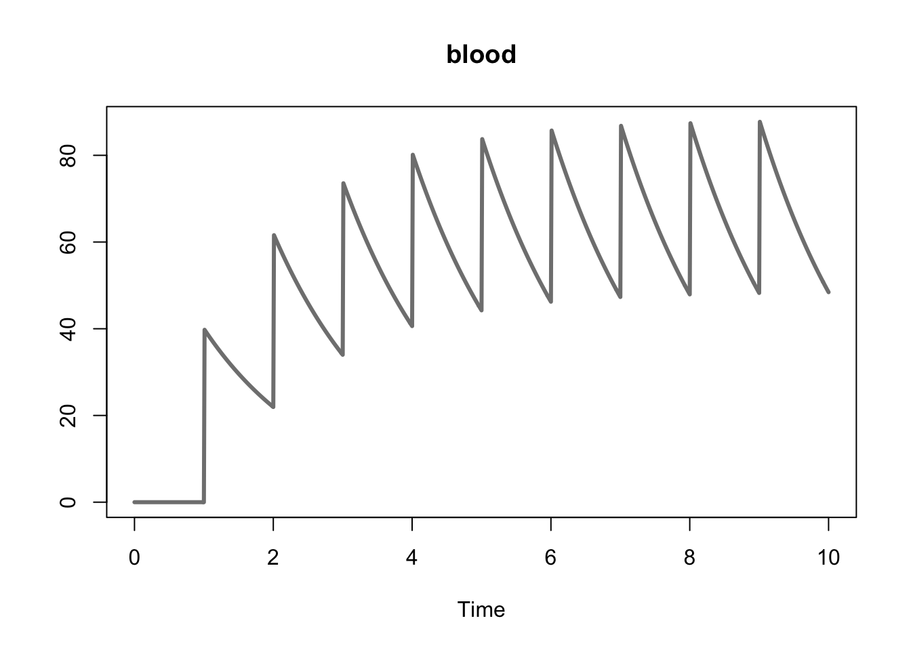
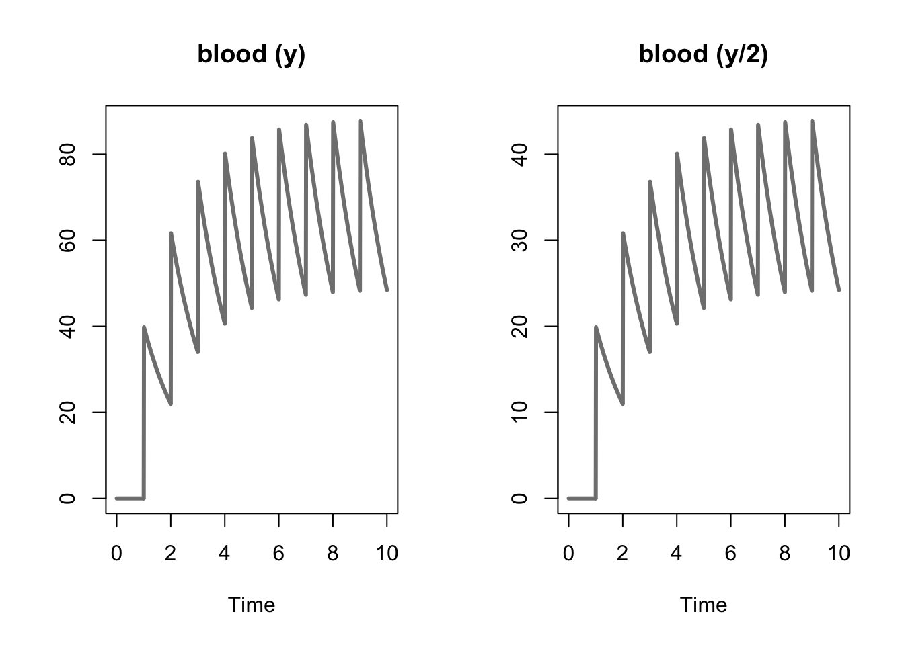

# Dosing


Dosing can be handled either in the `Model Events` block or by providing a data frame that describes a dosing table that can be called into the `simulate` function as the argument `dosingTable`. Both approaches are discussed below using, as an example, the following model of a simple one compartment model.

$$
\frac{d}{dt}y = -\theta \cdot y
$$

## Dosing in the Model Events Block

The model below defines dosing within the `Model Events` block for a simple one compartment model.


```
********** MODEL NAME

Simple One Compartment Dosing Model

********** MODEL NOTES

A simple one compartment dosing model where
ten equally spaced doses are given to the subject.

********** MODEL STATES

d/dt(y) = -theta * y

y(0) = 0

********** MODEL PARAMETERS

theta = 0.6

********** MODEL VARIABLES
********** MODEL REACTIONS
********** MODEL FUNCTIONS
********** MODEL EVENTS

% adding 40 units at a specified time step
event1 = eq(time, 1), y, y+40
event2 = eq(time, 2), y, y+40
event3 = eq(time, 3), y, y+40
event4 = eq(time, 4), y, y+40
event5 = eq(time, 5), y, y+40
event6 = eq(time, 6), y, y+40
event7 = eq(time, 7), y, y+40
event8 = eq(time, 8), y, y+40
event9 = eq(time, 9), y, y+40
```

Below we compile the model, simulate, and plot the variable.


```r
one_cpt <- create_model(system.file("examples/one_cpt.txt", package="AZRsim"))
#> Warning in check_azrmod(model): check_azrmod: AZRmodel contains state names
#> with a single character name. Try to avoid that if you plan to use NONMEM
#> or MONOLIX
one_cpt_simulation <- simulate(one_cpt, simtime = 10)
plot(one_cpt_simulation, col = "#808080", lwd = 3, plot_names = "blood")
```


## Dosing with a Dosing Table

The model below defines an analogous dosing regimen using the `INPUT*` variable in the system of differential equations for the same model. Note that `INPUT*` must be applied to the relevant variables in the `Model States` block. In this context a dose (the units of which will be defined in the dosing table) is added to the variable `y` at specific time intervals (also defined in the dosing table).


```
********** MODEL NAME

Simple One Compartment Dosing Model

********** MODEL NOTES

A simple one compartment dosing model where
the doses must be defined as a data frame in
the 'dosingTable' argument of the simulate
function.

********** MODEL STATES

d/dt(y) = -theta * y + INPUT1

y(0) = 0

********** MODEL PARAMETERS

theta = 0.6

********** MODEL VARIABLES
********** MODEL REACTIONS
********** MODEL FUNCTIONS
********** MODEL EVENTS
```

Below we construct a dosing table, compile the model, simulate, and plot the variable. The dosing table must be a data frame with the following columns,

* `TIME` - the time at which the does occurs.
* `DOSE` - the units of the dose.
* `DURATION` - how long the dose is administered.
* `INPUT` - which input variable the dose is associated with.
* `LAGTIME` - the lag time associated with each dose.


```r
one_cpt_dt <- create_model(system.file("examples/one_cpt_dt.txt", package="AZRsim"))
#> Warning in check_azrmod(model): check_azrmod: AZRmodel contains state names
#> with a single character name. Try to avoid that if you plan to use NONMEM
#> or MONOLIX
dt <- data.frame("TIME" = seq(1,9, by = 1),
                 "DOSE" = 40,
                 "DURATION" = 0,
                 "INPUT" = 1,
                 "LAGTIME" = 0,
                 stringsAsFactors = FALSE)
one_cpt_dt_simulation <- simulate(one_cpt_dt, 10, dosing_table = dt)
plot(one_cpt_dt_simulation, col = "#808080", lwd = 3, pars = "y", plot_names = "blood")
```



## Outputs

It is also possible to defined outputs from using `OUTPUT*` in the model. An example is provided below where the output is half of the state variable.


```
********** MODEL NAME

Simple One Compartment Dosing Model

********** MODEL NOTES

A simple one compartment dosing model where
the doses must be defined as a data frame in
the 'dosingTable' argument of the simulate
function.

********** MODEL STATES

d/dt(y) = -theta * y + INPUT1

y(0) = 0

********** MODEL PARAMETERS

theta = 0.6

********** MODEL VARIABLES

y_new = y/2
OUTPUT1 = y_new

********** MODEL REACTIONS
********** MODEL FUNCTIONS
********** MODEL EVENTS
```

Below we compile the model, simulate the state variables, and plot the results.


```r
one_cpt_out <- create_model(system.file("examples/one_cpt_output.txt", package="AZRsim"))
#> Warning in check_azrmod(model): check_azrmod: AZRmodel contains state names
#> with a single character name. Try to avoid that if you plan to use NONMEM
#> or MONOLIX
dt <- data.frame("TIME" = seq(1,9, by = 1),
                 "DOSE" = 40,
                 "DURATION" = 0,
                 "INPUT" = 1,
                 "LAGTIME" = 0,
                 stringsAsFactors = FALSE)
one_cpt_out_simulation <- simulate(one_cpt_out, 10, dosing_table = dt, output = c("y", "OUTPUT1"))
plot(one_cpt_out_simulation, col = "#808080", lwd = 3, plot_names = c("blood (y)", "blood (y/2)"))
```


