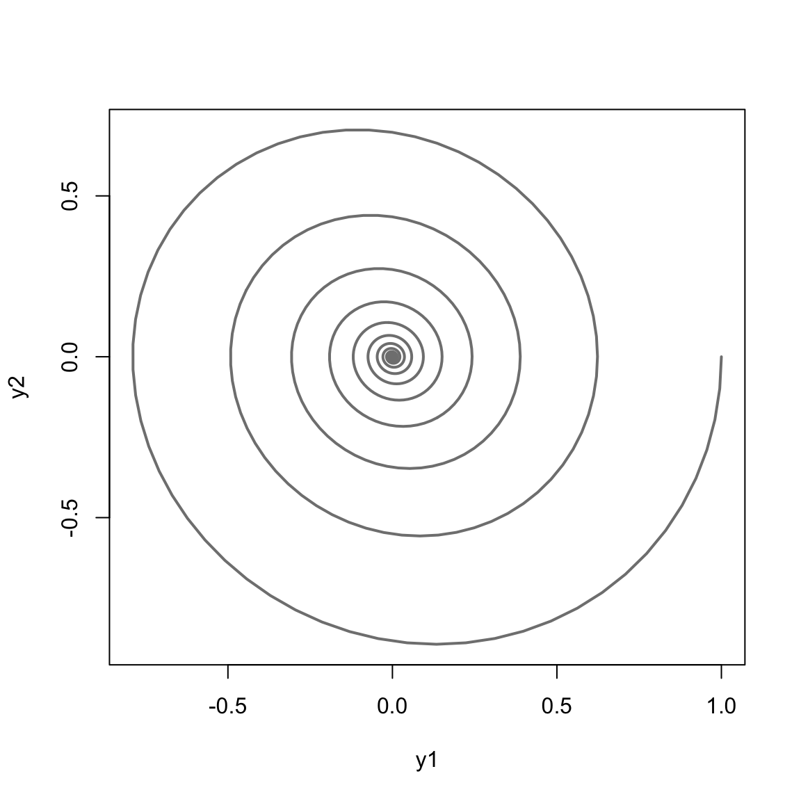
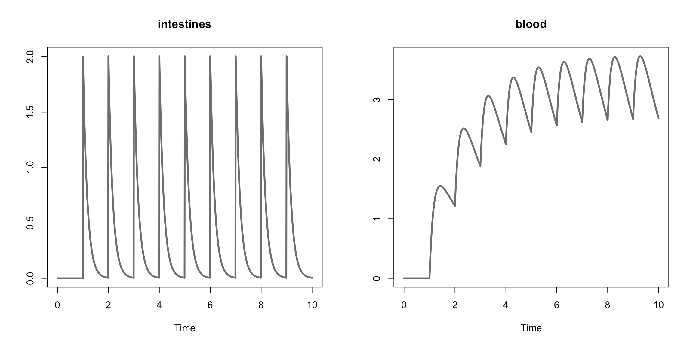

# Examples


## Simple Harmonic Oscillator

The equations that govern a harmonic oscillator are the following,

\begin{align*}
\frac{d}{dt}y_1 &= y_2 \\
\frac{d}{dt}y_2 &= - y_1-\theta \cdot y_2
\end{align*}

where $y_1$, $y_2$ are state variables and $\theta$ is a parameter in this model. The text file representation of the model is provided below.


```
********** MODEL NAME

Harmonic Oscillator

********** MODEL NOTES

Harmonic Oscillator ODE example.

********** MODEL STATES

d/dt(y1) = y2
d/dt(y2) = - y1 - theta * y2

y1(0) = 1
y2(0) = 0

********** MODEL PARAMETERS

theta = 0.15

********** MODEL VARIABLES
********** MODEL REACTIONS
********** MODEL FUNCTIONS
********** MODEL EVENTS
```

Compiling and simulating the model.


```r
sho_model <- create_model(system.file("examples/sho.txt", package="AZRsim"))
sho_sim <- simulate(sho_model, seq(0, 100, by=0.1))
head(sho_sim)
#>   TIME    y1      y2
#> 1  0.0 1.000  0.0000
#> 2  0.1 0.995 -0.0991
#> 3  0.2 0.980 -0.1957
#> 4  0.3 0.956 -0.2890
#> 5  0.4 0.923 -0.3780
#> 6  0.5 0.881 -0.4619
```

Plotting variables as a function of time.


```r
plot(sho_sim, col = "#808080", lwd = 3)
```


Plotting the variables as a function of each other.


```r
plot(sho_sim[,"y1"], sho_sim[,"y2"], type = "l", col = "#808080", lwd = 2, xlab = "y1", ylab = "y2")
```



## Two Compartment Model

Here we consider a simple two compartment model where, for example, we model the concentration of an oral drug in the intestines and in the blood. The ODE system takes the following form,

\begin{align*}
\frac{d}{dt}y_1 &= -a \cdot y_1 + u_t \\
\frac{d}{dt}y_2 &= a \cdot y_1 - b \cdot y_2
\end{align*}

where $y_1$ denotes the concetration of the drug the intenstine, $y_2$ denotes the concentration of the drug in the blood, $a$ and $b$ are parameters, and $u_t$ denotes the uptake of the drug at time period $t$.

The text file representation of the model above provided below.


```
********** MODEL NAME

Simple Two Compartment Dosing Model

********** MODEL NOTES

A simple two compartment dosing model where
ten equally spaced doses are given to the subject.

********** MODEL STATES

d/dt(y1) = -a * y1
d/dt(y2) = a * y1 - b * y2

y1(0) = 0
y2(0) = 0

********** MODEL PARAMETERS

a = 6
b = 0.6

********** MODEL VARIABLES
********** MODEL REACTIONS
********** MODEL FUNCTIONS
********** MODEL EVENTS

% adding 40 units at a specified time step
event1 = eq(time, 1), y1, y1+2
event2 = eq(time, 2), y1, y1+2
event3 = eq(time, 3), y1, y1+2
event4 = eq(time, 4), y1, y1+2
event5 = eq(time, 5), y1, y1+2
event6 = eq(time, 6), y1, y1+2
event7 = eq(time, 7), y1, y1+2
event8 = eq(time, 8), y1, y1+2
event9 = eq(time, 9), y1, y1+2
```

Below the model is compiled and simulated and the 10 initial and final values are presented.


```r
two_cpt <- create_model(system.file("examples/two_cpt.txt", package="AZRsim"))
#> Warning in check_azrmod(model): check_azrmod: AZRmodel contains parameter
#> names with a single character name. Try to avoid that if you plan to use
#> NONMEM or MONOLIX
two_cpt_simulation <- simulate(two_cpt, simtime = 10)
head(two_cpt_simulation, n = 10)
#>    TIME y1 y2
#> 1  0.00  0  0
#> 2  0.01  0  0
#> 3  0.02  0  0
#> 4  0.03  0  0
#> 5  0.04  0  0
#> 6  0.05  0  0
#> 7  0.06  0  0
#> 8  0.07  0  0
#> 9  0.08  0  0
#> 10 0.09  0  0
tail(two_cpt_simulation, n = 10)
#>       TIME      y1   y2
#> 992   9.91 0.00853 2.83
#> 993   9.92 0.00803 2.81
#> 994   9.93 0.00757 2.80
#> 995   9.94 0.00713 2.78
#> 996   9.95 0.00671 2.77
#> 997   9.96 0.00632 2.75
#> 998   9.97 0.00595 2.73
#> 999   9.98 0.00561 2.72
#> 1000  9.99 0.00528 2.70
#> 1001 10.00 0.00497 2.69
```

Using the `plot` generic we can plot the simulation to visualize the concentration of the drug in both compartments over time.


```r
plot(two_cpt_simulation, col = "#808080", lwd = 3, plot_names = c("intestines", "blood"))
```



Below we simulate the model with a different parameter value for $b$.


```r
two_cpt_simulation2 <- simulate(two_cpt, simtime = 10, parameters = c("a" = 6, "b" = 1))
plot(two_cpt_simulation2, col = "#808080", lwd = 3, plot_names = c("intestines", "blood"))
```


